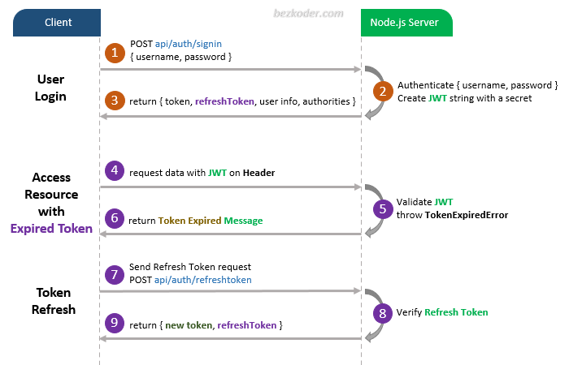

# Node.js MongoDB – User Authentication & Authorization example with JWT & Mongoose

## User Registration, User Login and Authorization process.

The diagram shows flow of how we implement User Registration, User Login and Authorization process.


You may need to implement Refresh Token:



## Project setup

```
npm install

npm i express nodemon cors jsonwebtoken bcryptjs cjs commonjs

npm install mongoose@6.11.2

npm update

npm audit fix --force

npx kill-port --port 8080

```

### Run

````````````````
node server.js
```````````````

### Postman
````````````````

```
## Git setup for :- Contact_Manager project

```

git status

// change from "master" branch to "Contact_Manager_Node_Express"
git branch -M Contact_Manager_Node_Express

git init

git add README.md

git config user.email "vishnuvarthan.mail@gmail.com"

git config user.name "Vishnuvarthan"

git add .

git commit -m "Node.js, Express, MongoDB, Build Rest API Project Express and JWT & EXPRESS Authentication Crash"

git branch -M Contact_Manager_Node_Express

git remote add origin https://github.com/Vishnuvarthangs/Vishnuvarthan.git

git push -u origin Contact_Manager_Node_Express
//To https://github.com/Vishnuvarthangs/Vishnuvarthan.git
// ! [rejected] Contact_Manager_Node_Express -> Contact_Manager_Node_Express (fetch first)
//error: failed to push some refs to 'https://github.com/Vishnuvarthangs/Vishnuvarthan.git'

git push -f origin Contact_Manager_Node_Express
