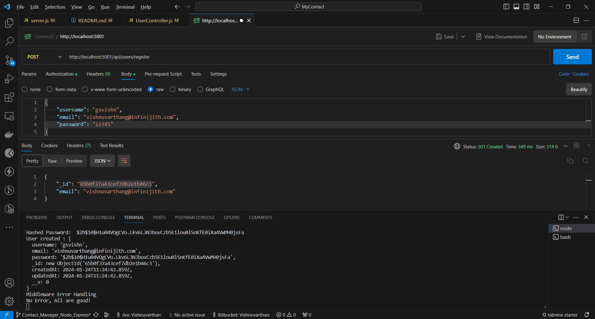
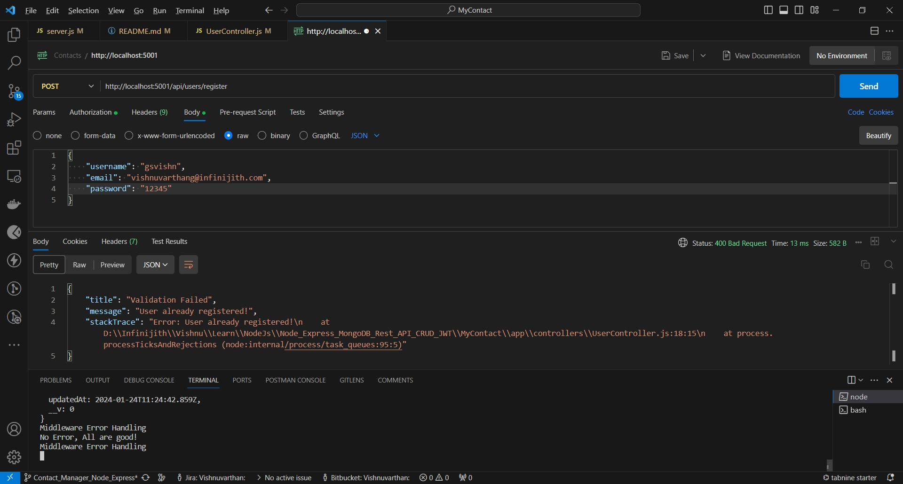
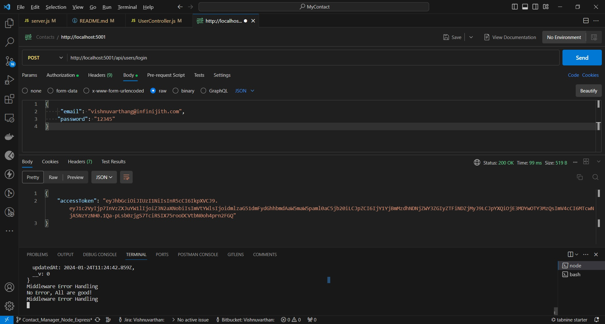

https://www.youtube.com/watch?v=H9M02of22z4

https://www.youtube.com/watch?v=ICMnoKxlYYg

# Express_MongoDB_Rest_API_Tutorial

This is express &amp; mongodb rest api tutorial for contact management app

# Node.js MongoDB – User Authentication & Authorization example with JWT & Mongoose

## User Registration, User Login and Authorization process.

The diagram shows flow of how we implement User Registration, User Login and Authorization process.


You may need to implement Refresh Token:


## Project setup

```
npm install

npm i express

npm i -D nodemon

npm i dotenv

npm i express-async-handler

npm i mongoose

npm i bcrypt

npm i jsonwebtoken

-----------------------------------

npm run start

npm run dev

npm update

npm audit fix --force

npx kill-port --port 5001


```

### Run

```
node server.js

or

nodemon server.js
```

### Postman

```
http://localhost:5001/  -- GET

http://localhost:5001/api/contacts  -- GET

http://localhost:5001/api/contacts -- POST

http://localhost:5001/api/contacts/1 -- PUT

http://localhost:5001/api/contacts/1 -- DELETE

http://localhost:5001/api/contacts/1  -- GET

http://localhost:5001/api/contacts -- POST

    {
        "name": "Vishnu",
        "email": "vishnu@infinijith.com",
        "phone": "0987654321",
    }

http://localhost:5001/api/contacts -- POST

    {

    }

http://localhost:5001/api/contacts -- POST   -- Create Contact

{
    "name": "Vishnu",
    "email": "vishnu@infinijith.com",
    "phone": "0987654321",
}

http://localhost:5001/api/contacts -- GET

{
    "name": "Vishnu",
    "email": "vishnu@infinijith.com",
    "phone": "0987654321"
}

http://localhost:5001/api/contacts/ id:- should add here for individual contact -- GET

{
    "name": "Vishnu",
    "email": "vishnu@infinijith.com",
    "phone": "0987654321"
}

http://localhost:5001/api/contacts/ id:- should add here for individual contact and change the id (should display "Contact Not Found") -- GET

{
    "name": "Vishnu",
    "email": "vishnu@infinijith.com",
    "phone": "0987654321"
}

http://localhost:5001/api/contacts/  id:- should add here for individual contact -- PUT  -- Update Contact

  {
    "name": "Vishnuvarthan",
    "email": "vishnuvarthang@infinijith.com",
    "phone": "0123456789"
}

http://localhost:5001/api/contacts/  id:- should add here for individual contact -- DELETE  -- Delete Contact

  {
    "name": "Vishnuvarthan",
    "email": "vishnuvarthang@infinijith.com",
    "phone": "0123456789"
}

http://localhost:5001/api/contacts/  id:- should add here for individual contact -- GET   --> After delete the contact choose GET -- display "Contact not found"

  {
    "name": "Vishnuvarthan",
    "email": "vishnuvarthang@infinijith.com",
    "phone": "0123456789"
}

http://localhost:5001/api/users/register -- POST

Output
{
    "message" : "Register the User"
}

http://localhost:5001/api/users/login -- POST

Output
{
    "message" : "Login User"
}

http://localhost:5001/api/users/currrent -- GET

Output
{
    "message" : "Current user information"
}

http://localhost:5001/api/users/register -- POST

{
    "username": "gsvishn",
    "email": "vishnuvarthang@infinijith.com",
    "password": "12345"
}

Hashed Password has been saved in database

The diagram shows flow of how we register thet User Registration, User Login and Authorization process.




http://localhost:5001/api/users/register -- POST -- hit again same user already

Output

User already registered

The diagram shows flow of User already registered.




http://localhost:5001/api/users/login -- POST

{
    "email": "vishnuvarthang@infinijith.com",
    "password": "12345"
}

Output has been saved in database
{
    "accessToken": "12345" (ex) -- will display the access token
}

The diagram shows flow of User login with JSON Web Token.




http://localhost:5001/api/users/current -- GET

The diagram shows flow of User login with JSON Web Token Authentication with BearerToken  -- 1st way


The diagram shows flow of User login with JSON Web Token Header based Authentication with BearerToken -- 2nd way


The diagram shows flow of User login with JSON Web Token Header based Authentication with BearerToken -- 2nd way -- throw error need to change GET method


The diagram shows flow of User login with JSON Web Token Header based Authentication with BearerToken -- 2nd way -- throw error -- Whether_Token-Expired_or_Not_ValidToken


http://localhost:5001/api/users/login -- POST  -- Whether_Token-Expired_or_Not_ValidToken  -- need to generate new token

{
    "email": "vishnuvarthang@infinijith.com",
    "password": "12345"
}

The diagram shows flow of User login with JSON Web Token Header based Authentication with BearerToken -- 1st way -- shows the username, email and id


```

## Git setup for :- Contact_Manager project

```

git status
```

## Should change from "master" branch to "Contact_Manager_Node_Express" line below

```
git branch -M Contact_Manager_Node_Express

git init

git add README.md

git config user.email "vishnuvarthan.mail@gmail.com"

git config user.name "Vishnuvarthan"

git add .

git commit -m "Node.js, Express, MongoDB, Build Rest API Project Express and JWT & EXPRESS Authentication Crash"

git branch -M Contact_Manager_Node_Express

git remote add origin https://github.com/Vishnuvarthangs/Vishnuvarthan.git

git push -u origin Contact_Manager_Node_Express

```

# Throw below error git push -u, because we need to git push -f

# To https://github.com/Vishnuvarthangs/Vishnuvarthan.git

# ! [rejected] Contact_Manager_Node_Express -> Contact_Manager_Node_Express (fetch first)

# error: failed to push some refs to 'https://github.com/Vishnuvarthangs/Vishnuvarthan.git'

```

git push -f origin Contact_Manager_Node_Express

```

## Project setup Below contents :- Contact_Manager project

```

Intro
Project Introduction & Rest API convention
Project Setup - Contact Management App
Create an Express Server
Thunder Client Setup -- Instead of using "Thunder Client" have use "Postman"
Express Router & Contacts CRUD Route Setup
Create Contact Controller for Contacts CRUD Operations
Multiple HTTP Methods per Route
Built-in Middleware for POST Request Body
Express - Throw Error
Error Handling Middleware
Express Async Handler
MongoDb Setup
Connect Express App to MondoDB Database
Mongoose Schema for Contacts
CRUD Get All Contacts
CRUD Create New Contact
CRUD Get Contact
CRUD Update Contact
CRUD Delete Contact
Adding User Routes - Registration, Login & Current
Adding User Controller
Mongoose Schema for User
User Registration & Password Hashing
JWT Access Token & User Login
Protecting Routes - User
Verify JWT Token Middleware
Handle Relationship User & Contact Schema
Protecting Routes - Contact
Logged in User Get All Contacts
Logged in User Create New Contact
Logged in User Update & Delete Contact
Outro
```
